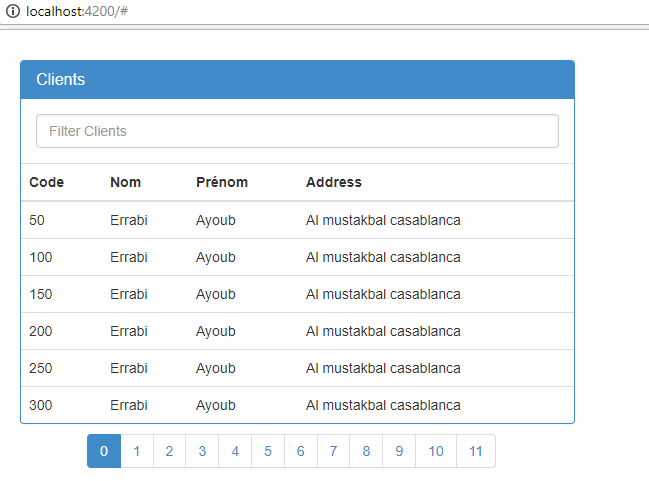

# Spring-Angular5-Pagination
This's an example that show how to create a pagination based on Spring data and Angular 5 : 
There's two modules : 
- Client :  A simple application that provide a rest web service to be consumed by the http client,it's a spring boot application that use spring data for the repository layer and the pagination.
- Client GUI : A simple angular 5 application that will be used to consume the rest web service provider by the module client and to provide the pagination. 

